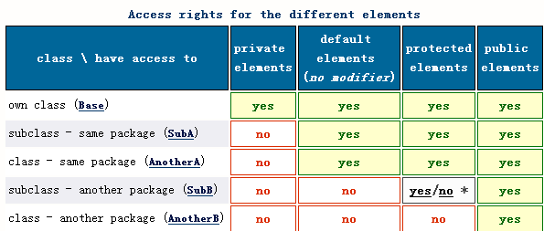

### Interviews

> 基于jdk1.8整理，不一样的java面试宝典。


### 目录  

* [java基础](#java基础)
  * [面向对象的特征有哪些方面](#面向对象的特征有哪些方面)
  * [谈谈java控制权限](#谈谈java控制权限)
  * [&和&&的区别](#和的区别)
  * [java所有类都继承Object类吗](#java所有类都继承object类吗)
  * [==和equals方法有什么区别](#和equals方法有什么区别)
* [java高级](#java高级)
* [spring框架](#spring框架)  
* [jvm](#jvm)  
* [高并发](#高并发)
* [大数据](#大数据)
* [源代码](#源代码)  


### java基础

####  面向对象的特征有哪些方面 

```text
抽象   
  
  抽象是将一类对象的共同特征总结出来构造类的过程，包括数据抽象和行为抽象两方面。
    
  抽象只关注对象有哪些属性和行为，并不关注这些行为的细节是什么。 
 
封装  
  
  封装是把数据和操作数据的方法绑定起来，对数据的访问只能通过已定义的接口。
  
继承  
  
  继承是从已有类得到继承信息创建新类的过程。
    
  提供继承信息的类被称为父类（超类、基类）；得到继承信息的类被称为子类（派生类）。  
  
多态  
  
  多态性是指允许不同子类型的对象对同一消息作出不同的响应。  
    
  方法重载（overload）实现的是编译时的多态性（也称为前绑定），而方法重写（override）实现的是运行时的多态性（也称为后绑定）。  
    
  运行时的多态是面向对象最精髓的东西，要实现多态需要做两件事：
    
  1). 方法重写（子类继承父类并重写父类中已有的或抽象的方法）；  
    
  2). 对象造型（用父类型引用引用子类型对象，这样同样的引用调用同样的方法就会根据子类对象的不同而表现出不同的行为）。
```  

分析:  

```text
抽象:   
  
  比如要建立一个动物类，想想动物的共同属性和方法，吃东西、睡觉、移动等，这个提取共同特性的过程就叫做抽象，
  
  在抽象过程中我们并没有考虑具体的细节，比如大象和猴子吃东西的不同之处这些细节。  
  
封装:    
  
  我们在使用手机的时候，简单几个按键我们就能拨打电话、聊微信，但是我们不能了解内部cpu怎么计算的，
    
  怎么和基站交互的这些细节，我们只能了解到手机暴露给我们的接口，即是我们能操作的功能。  
  
继承:  
  
   比如继承遗产，这大家比较好理解。继承让变化中的软件系统有了一定的延续性。  
  
多态:  
  
  比如我们跟手机充电可以通过插头交流电充电，也可以使用充电宝冲电。我们事先并不知道，
    
  当我们具体使用的时候才确定，这就是运行时多态的表现。不论是交流电还是充电宝，
    
  它们都具备给手机充电的功能。我们事先不用知道是哪种方式，比如在真正充电的时候，  
  
  我们使用充电宝了，那就是使用充电宝给手机充电。
   
```  

#### 谈谈java控制权限  
  
```text
java中为什么要设计访问权限控制机制:  
  
  1.为了使用户不要触碰那些他们不该触碰的部分，这些部分对于类内部的操作时必要的，但是它并不属于客户端程序员所需接口的一部分。  
    
  2.为了让类库设计者可用更改类的内部工作方式，而不必担心会对用户造成重大影响。  
  
  
Java中的访问权限控制的等级，按照权限从大到小依次为:
  
  public -> protected -> 包访问权限（没有权限修饰词）-> private
  
  public: 所有类都可以访问。 
  
  protected: 继承访问权限。
  
  1.基类的protected成员是包内可见的，并且对子类可见。
    
  2.若子类与基类不在同一包中，那么在子类中，子类实例可以访问其从基类继承而来的protected方法，而不能访问基类实例的protected方法。
     
     子类与基类不在同一包时，具体情况如下：
     
     a.在子类中直接使用父类的protected变量是可以的，父类的protected权限的成员变量可以被子类继承。
     
     b.在子类中使用父类的对象访问父类的protected成员反而是不行的。
     
     c.在子类中通过本类的对象访问父类的protected成员是可以的。
     
     d.在子类中使用其他子类的对象访问父类的protected成员也是不行的。
    
  private: 只有本类可以访问。  
    
  包访问权限:有时也表示为friendly,在同一个包中可以访问(如果不提供任何访问权限修饰词，则意味着它是包访问权限)。
```  

分析: 

```text
假如你是jdk的设计开发者，你为什么要设计访问权限呢？归根到底无非几点：
  
  1.我有些实现细节要隐藏起来,你调用的时候不用关心。
    
  2.我有些东西是我程序内部运行需要的，你不能任意改动，改动会出现不能运行等问题。
  
那设计个public和private不就完了吗，实际业务中我们会发现，我们想要更灵活的访问权限，于是就有了包访问权限和protected。
  
这里需要注意包访问权限，jdk1.8之前可以表示为default,但是jdk1.8以后接口引入了default关键字，也有表示为friendly的，  
  
实际就是个代号，在修饰的对象前什么都不加就是包访问权限了。    
  
那protected访问权限呢？    
  
新类（称之子类或派生类）通过继承可以复用一个现有类（称之父类或基类），然后扩展基类的成员、方法。
  
有时，基类的创建者会希望某个特定成员，将它的访问权限赋予派生类而不是所有类。public无法做到这一点，为此，  
  
引入了protected来完成这一工作。 protected也提供包访问权限，也就是说，派生类以及相同包内的其他类都可以访问protected成员或方法。   
  
  
balabala说了一堆，有的同学估计都没耐心看了，说你敢不敢来点代码，no code no bb。下面咱就来个代码，往下看code来了。

```  
  
假设场景:

```text
假设有个程序员大神叫宙斯（Zeus),这个大神有2个儿子：阿波罗（Apollo）和阿瑞斯（Ares),悲催的是阿波罗（Apollo）是亲生的，  
  
阿瑞斯（Ares)是垃圾堆里捡的，这2兄弟都想找他daddy要100块钱买咸蛋超人，现在就看他daddy到底会不会偏袒哪个儿子吧。  
   
本故事纯属虚构，如有雷同纯属巧合，不喜勿喷。  
  
  
先来看看他爹Zeus有多少钱，是不是暴发户？
```  

code:

```java
package base;

public class Zeus {
    private int money = 1000;

    protected void giveMoney(int m) {
        this.money = this.money - m;
    }
}
```

```text
尼玛钱都用来养这2个熊孩子和还房贷了，就剩下1000块，看看Apollo到底是不是亲生的？
```

```java
package base;

public class Apollo extends Zeus{
    public static void main(String[] args) {
        new Apollo().giveMoney(100);
    }
}
```

```text
编译通过了，果然是亲生的，嗯嗯，肯定做过dna验证了。再来看看Ares这熊孩子，
  
Ares这熊孩子鸡贼的很，撒谎跟他爹Zeus说是Apollo想要钱买芭比娃娃,看看啥结果？
```

```java
package extend;

import base.Apollo;
import base.Zeus;

public class Ares extends Zeus {
    public static void main(String[] args) {
        new Apollo().giveMoney(100);  //compile fail
    }
}
```

```text
编译失败了，被他爹识破了。还是实话实说吧。
```

```java
package extend;

import base.Apollo;
import base.Zeus;

public class Ares extends Zeus {
    public static void main(String[] args) {
        new Ares().giveMoney(100);  
    }
}
```

```text
编译通过了,看来这爹还行，对2个儿子一视同仁。Ares撒的这慌被Apollo知道了，Apollo心里不爽，
  
也想以Ares的名义撒一次慌,说Ares想买咸蛋超人。
```

```java
package base;

import extend.Ares;

public class Apollo extends Zeus{
    public static void main(String[] args) {
        new Ares().giveMoney(100);
    }
}
```

```text
编译通过了,竟然把他爹蒙住了。哈哈～～
  
事又来了，宙斯（Zeus)的兄弟波塞冬（Poseidon）好吃懒做，平时给学校门口小卖部赊帐买辣条，
  
赊了200块，老板娘逼债，没办法只能找宙斯（Zeus)要钱还债。（他们家破事真多，我都懒得管～～）
```

```java
package base;

public class Poseidon {
    public static void main(String[] args) {
        new Apollo().giveMoney(100);
    }
}
```
```text
编译通过了，没办法毕竟还是亲兄弟，Zeus泪奔～～～
  
可以初略地记录：在同一个包下可以任意访问，甚至欺骗；不在同一个包下，不允许欺骗。
```

总结:

```text
 1.基类的protected成员是包内可见的，并且对子类可见。
  
 2.若子类与基类不在同一包中，那么在子类中，子类实例可以访问其从基类继承而来的protected方法，而不能访问基类实例的protected方法。
   
   子类与基类不在同一包时，具体情况如下：
   
   a.在子类中直接使用父类的protected变量是可以的，父类的protected权限的成员变量可以被子类继承。
   
   b.在子类中使用父类的对象访问父类的protected成员反而是不行的。
   
   c.在子类中通过本类的对象访问父类的protected成员是可以的。
   
   d.在子类中使用其他子类的对象访问父类的protected成员也是不行的。
```



吐槽:

```text
很多介绍Java语言的书籍(包括《Java编程思想》)都对protected介绍的比较的简单，基本都是一句话，就是:被protected修饰的成员对于本包和
  
其子类可见。这种说法有点太过含糊，常常会对大家造成误解。本人也被误导了很多年，哈哈，泪奔～～～  
  
其实大家想下，如果在不同包内能够通过其他子类对象（欺骗）的方式访问，那等于是基类的成员间接暴露出来了，这种是不安全的，没有达到控制的目的。
  
正是因为如此，才感觉jdk开发大牛设计的严谨，十分考究，我等小菜鸟的确是鞭长莫及啊～～～
```

#### &和&&的区别  

```text
& 表示位运算或逻辑与。
  
&& 表示逻辑与，相比&有短路功能。
```

解析:

```text
& 表达式是boolean类型时表示逻辑与；不是boolean类型时表示位运算；
```

#### java所有类都继承Object类吗

```text
1. 基本数据类型（boolean、char、byte short int long 、float double）不继承Object类。
  
2. 基本数据类型包装类（Boolean、Character、Byte Short Integer Long、Float Double）继承Object类。
  
3. String继承Object类。
  
4. interface不继承Object类。
   
5. 数组继承Object类。
```

解析:

```text
大家想想基本数据类型设计在jvm中，而Object类位于jdk中，jdk的运行依赖jvm,也就是jdk相对于jvm属于上层应用，那些大神们不可能设计一个依赖上层
  
应用的东西，这也不符合设计原则，所以基本数据类型不可能继承Object类。由于java属于面向对象的，设计jdk的这些大神们于是在jdk里给这些基础类设
  
计了对应的包装类，这些包装类就继承Object类。
  
String不属于基本数据类型，他是设计在jdk中的，继承Object类，并且重写了equals方法。
  
接口由于需要被继承实现，所以也不可能继承Object类。实际接口继承了Object接口，可能很多同学没听过还有Object接口，这里也不做具体阐述，
  
有兴趣的同学可以自己研究（org.omg.CORBA包下的Object接口）。
  
数组继承Object类，我们可以通过最简单的代码测试：
  
  int[] a = {1, 2};
  Object b = a;
  System.out.println(b);
  
可以编译通过，并且输出对象内存地址，说明数组默认继承了Object类。
  
也许还有同学会说，继承不是要通过extend关键字实现吗，String也没有显示extend Object啊。
  
大家想想如果jdk里的所有类如果都继承Object类，大家会一个一个类上面写extend Object吗，是不是想抽取出来实现，实现jdk的这些大神也是一样，
  
他们把这些公用抽取出来，让大家解脱出来。大家也许很好奇怎么实现的呢，大家可以大胆的做猜想：
  
1. 在编译源代码时，当遇到没有父类的类时，编译器会将其指定一个默认的父类（一般为Object），而虚拟机在处理到这个类时，
   
   由于这个类已经有一个默认的父类了，因此，VM仍然会按着常规的方法来处理每一个类。对于这种情况，从编译后的二进制角度来看，所有的类都会有
     
   一个父类。

  
2. 编译器仍然按着实际代码进行编译，并不会做额外的处理。如果一个类没有显式地继承于其他的类，编译后的代码仍然没有父类。
  
   然后由虚拟机运行二进制代码时，当遇到没有父类的类时，就会自动将这个类看成是Object类的子类（一般这类语言的默认父类都是Object）。

  
第1种情况是在编译器上做的文章，也就是说，当没有父类时，由编译器在编译时自动为其指定一个父类。
  
第2种情况是在虚拟机上做文章，也就是这个默认的父类是由虚拟机来添加的。
  
至于是哪种，笔者也不知道，毕竟还没好好看jvm源码，泪奔～～
  
大家感兴趣的可以自己研究，也欢迎研究好告诉笔者。
```


#### ==和equals方法有什么区别

```text
== 操作符用来比较两个变量的值是否相等，也就是用于比较变量所对应的内存中所存储的数值是否相同。
  
  1.比较基本数据类型时，比较的是基本数据类型的值。
  
  2.比较引用数据类型时，比较的是引用数据类型是否指向同一引用。
  
equals 操作符一般用来比较两个独立对象的内容是否相同。
```

解析:

```text
== 操作符：
  
  比较2个基本数据类型是否相等时，使用 == 操作符；
  
  比较2个对象引用是否指向同一对象时，也就是是否是同一对象，使用 == 操作符，实际比较的是2个对象指向的内存区域首地址,首地址相同，
  
  即指向同一块内存区域，即指向同一对象的引用；
  
equals 操作符：
  
  java所有类默认继承Object类，下面看下Object类的equals方法：
  
  public class Object {
     public boolean equals(Object obj) {
        return (this == obj);
     }
  }
  
  可以看出Object的equals默认比较的是两个对象是否相同，由于java所有类默认继承Object类，所以默认比较的是两个对象是否相同。
  
  现在在看下String类，重写了默认父类Object类的equals方法:
    
   public final class String implements java.io.Serializable, Comparable<String>, CharSequence {
       public boolean equals(Object anObject) {
               if (this == anObject) {
                   return true;
               }
               if (anObject instanceof String) {
                   String anotherString = (String)anObject;
                   int n = value.length;
                   if (n == anotherString.value.length) {
                       char v1[] = value;
                       char v2[] = anotherString.value;
                       int i = 0;
                       while (n-- != 0) {
                           if (v1[i] != v2[i])
                               return false;
                           i++;
                       }
                       return true;
                   }
               }
               return false;
           }
   }
   
   可以看出String类先比较是否为同一对象，然后比较内容是否相同，由于同一个对象的话内容肯定也相同，实际String类比较的是内容。
     
   实际应用中我们比较常用的也是重写equals方法，进行对象内容的比较。

```


### java高级  


### spring框架   


### jvm   


### 高并发   


### 源代码

